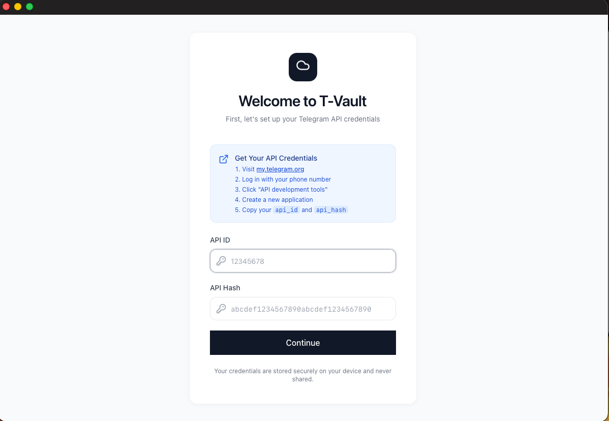

# T-Vault Desktop App 🚀

> Unlimited cloud storage powered by Telegram - Built for macOS

### 📺 [Watch the Demo Video](Media/T-vault.mp4)
*(If the video doesn't play directly in your browser, you can find it in the `Media` folder of this repository.)*


## 💡 Who is this for?

- **Indie developers & makers** who want free, reliable storage for project files
- **Photographers & creators** looking for an alternative to paid cloud storage
- **Privacy-conscious users** who want control over where their files live
- **Telegram power users** who already trust Telegram with their data
- **Anyone tired of paying monthly fees** for cloud storage they rarely use

## 🎯 Why T-Vault?

| Feature | T-Vault | Unlim | Telegram Web | iCloud/Google Drive |
|---------|---------|-------|--------------|---------------------|
| Native macOS App | ✅ | ❌ | ❌ | ✅ |
| Unlimited Storage | ✅ | ✅ | ✅ | ❌ |
| Gallery View | ✅ | ❌ | ❌ | ✅ |
| File Folders | ✅ | ❌ | ❌ | ✅ |
| **Monthly Cost** | **Free** | Free | Free | $2-10+ |
| Beautiful UI | ✅ | ❌ | ❌ | ✅ |

**What makes T-Vault different:** A native macOS experience that doesn't feel like a web app. Fast uploads, beautiful gallery view, and everything stays in your Telegram account.

## ✨ Features

- **🔒 Secure Login**: Seamless authentication with your Telegram account
- **📂 File Management**: Upload, download, and organize files in folders
- **🖼️ Gallery View**: Beautiful gallery for photos and videos
- **💾 Unlimited Storage**: Leverage Telegram's infrastructure for unlimited file storage
- **🎨 Native macOS UI**: Beautiful, modern interface that feels right at home on macOS
- **🔐 In-App Setup**: Easy API key configuration through the UI
- **🖱️ Drag & Drop Upload**: Simply drag and drop files directly into the app to upload
- **✅ Mass Selection**: Select multiple files at once for batch upload or delete operations

## 🚀 Getting Started

### 1. Download
Download the latest `.dmg` file from the [Releases](../../releases) page.

### 2. Install
Open the `.dmg` file and drag **T-Vault** to your **Applications** folder.

### 3. Setup API Credentials
To use T-Vault, you need your own Telegram API keys:

1. Go to [my.telegram.org](https://my.telegram.org) and log in.
2. Click on **API development tools**.
3. Create a new application (you can use any name).
4. Copy your `App api_id` and `App api_hash`.
5. Open T-Vault and enter these credentials in the setup screen.



### 4. Login
After configuring your API keys, log in with your Telegram phone number and enter the verification code sent to your Telegram app.

## 📸 Gallery

Experience your media like never before with our native gallery view. T-Vault automatically categorizes your photos and videos, providing a seamless browsing experience directly from your Telegram storage.

*(Check out the video at the top for a full demo of the gallery in action!)*

## 🎯 How It Works

T-Vault uses a clever approach to provide unlimited storage:

1. **Authentication**: You log in with your Telegram account using their official API.
2. **File Upload**: Files are uploaded to your Telegram "Saved Messages".
3. **Metadata Storage**: A JSON structure tracks your folder organization.
4. **Retrieval**: Files are downloaded from Telegram when needed.
5. **Sync**: Files are accessible from any device with Telegram.

### New Features

#### Drag & Drop Upload
Simply drag files from Finder and drop them directly into T-Vault to upload. A visual overlay appears when you drag files over the app, showing you exactly where they'll be uploaded.

#### Mass Selection
- Click checkboxes to select multiple files
- Drag to create a selection box (lasso) for quick multi-select
- Use "Select all" to select all visible files
- Perform bulk actions: download multiple files at once or delete multiple items
- Selection toolbar shows count of selected items

## 🔐 Security & Privacy

- **Secure Storage**: API keys are stored in the app's data directory (not in the project).
- **No Hardcoded Credentials**: All credentials are user-provided.
- **Secure Sessions**: Telegram sessions are stored locally.
- **No Third Parties**: Direct communication with Telegram's API.
- **Your Data**: Everything stays in your Telegram account.

## ❓ FAQ

### Is this safe to use?
T-Vault uses Telegram's official API, so your files are as secure as your Telegram account. However, please note:
- This is a **gray area** usage of Telegram's platform
- Use responsibly and avoid excessive automated uploads
- Your files are stored on Telegram's servers
- Telegram could change their policies at any time
- **Not recommended as your only backup solution**

### Will Telegram ban me?
Telegram hasn't taken action against similar tools, but we recommend using T-Vault responsibly. Don't use it for mass automation or spam.

### What happens if Telegram changes their API?
If Telegram makes breaking changes, we'll update T-Vault accordingly. Your files remain safe in your Telegram account.

### Can I access my files from my phone?
Yes! Since files are stored in your Telegram "Saved Messages", you can access them from any device with Telegram installed.

## 🙏 Requests

Have a feature in mind or found a bug? We'd love to hear from you!
- **Feature Requests**: Open an issue with the `enhancement` label.
- **Bug Reports**: Open an issue with the `bug` label.
- **General Feedback**: Join our GitHub Discussions.

## 🐛 Troubleshooting

### "Invalid API credentials" error
- Double-check your API ID and API Hash from [my.telegram.org](https://my.telegram.org).
- Make sure there are no extra spaces or characters.

### "Failed to connect to Telegram"
- Check your internet connection.
- Ensure you're not behind a restrictive firewall.

### "Session expired"
- The app will prompt you to log in again. Your files remain safe in Telegram.

### File upload issues
- **File size limit**: Individual files larger than **2GB** cannot be uploaded due to Telegram's API limitations
- **Batch upload limit**: Uploading **75+ files at once** may fail due to Telegram's rate limiting. Try uploading in smaller batches (50 files or less)

## 🛠️ Development

If you'd like to build T-Vault from source or contribute to the project:

### Prerequisites
- **Node.js** (v20 or higher)
- **Rust** (latest stable version)

### Build Instructions
```bash
# Clone the repository
git clone https://github.com/rxchitrx/T-Vault.git
cd T-Vault

# Install dependencies
npm install

# Run in development mode
npm run tauri:dev

# Build for production
npm run tauri:build
```

### Project Structure
```
t-vault/
├── src/                      # React frontend
├── src-tauri/               # Rust backend
│   ├── src/
│   │   ├── telegram.rs     # Telegram API integration
│   │   └── storage.rs      # File storage logic
└── ...
```

## 🗺️ Roadmap

- [x] macOS Desktop App
- [x] In-app API key configuration
- [ ] **Windows Desktop App** (coming if there's enough interest!)
- [ ] iOS Companion App
- [ ] Real-time sync between devices
- [ ] File sharing with other users
- [ ] Advanced search capabilities

> **Windows Users**: We're considering building a Windows version of T-Vault! If you're interested, please ⭐ star the repository and let us know in the [issues](../../issues) or [discussions](../../discussions). Your feedback helps us prioritize platforms to support next!

## 🤝 Contributing

Contributions are welcome! Please feel free to submit a Pull Request.

## 📄 License

This project is licensed under the MIT License - see the [LICENSE](LICENSE) file for details.

## ⚠️ Disclaimer

This application is not affiliated with or endorsed by Telegram. Use at your own risk.

## 💖 Acknowledgments

- Built with [Tauri](https://tauri.app/)
- Powered by [Telegram](https://telegram.org/)
- Inspired by [Unlim](https://github.com/inulute/unlim-cloud)

## 📞 Support

If you encounter any issues, please open an issue on GitHub.

---

Made with ❤️ for the macOS community
